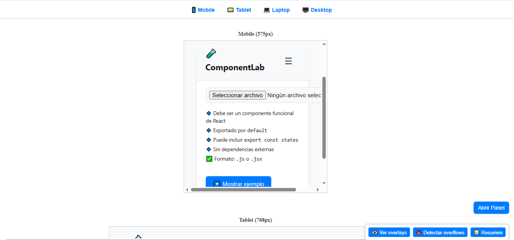
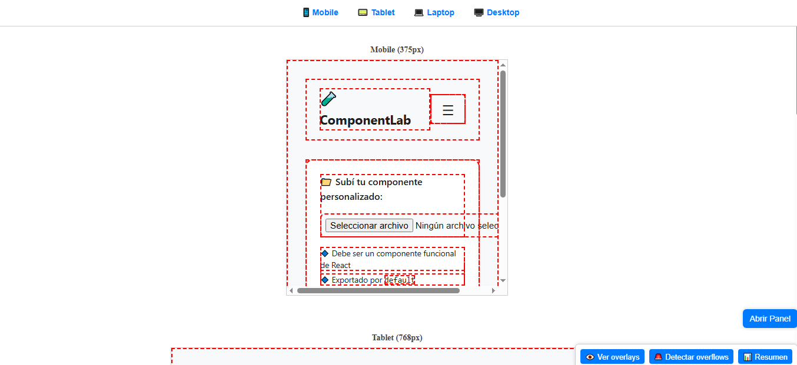
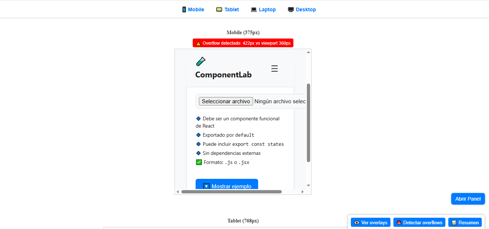

# 🔍 Breakpoints Explorer – Visualiza tu sitio en múltiples dispositivos a la vez

**Breakpoints Explorer** es una extensión de navegador que te permite previsualizar cualquier sitio web en simultáneo en 4 breakpoints distintos: Mobile, Tablet, Laptop y Desktop.

Ideal para desarrolladores, diseñadores, testers y QA que necesitan verificar visualmente si una web es responsiva — sin abrir DevTools o cambiar de pestaña.

---

## 🚀 Características

- 📱 Vista simultánea en 4 dispositivos
- 🎯 Botón flotante para activar/desactivar el panel
- 🛠️ Herramientas de análisis:
  - Ver elementos interactivos (`:hover`)
  - Detectar desbordes (`overflow`)
  - Verificar si el sitio usa `<meta name="viewport">`
- 📊 Modal con resumen técnico por viewport
- 🔗 Navegación rápida entre breakpoints desde una barra fija

---

## 🖥️ Breakpoints incluidos

| Dispositivo | Ancho | Alto simulado |
|------------|-------|---------------|
| Mobile     | 375px | 812px (iPhone X) |
| Tablet     | 768px | 1024px         |
| Laptop     | 1024px| 768px          |
| Desktop    | 1440px| 900px          |

---

## 💡 ¿Cómo se diferencia de DevTools?

DevTools te permite inspeccionar un solo tamaño a la vez.  
**Breakpoints Explorer** te permite ver todos los tamaños simultáneamente con herramientas visuales activas, sin modificar tu flujo de trabajo.

---

## 📦 Instalación manual

### 1. Descargar el proyecto
Descargá este repositorio como ZIP o clonalo:

git clone https://github.com/juancruz12345/breakpoints-explorer.git

### 2. En Chrome (o Brave, Edge, Vivaldi):

        Ir a chrome://extensions/

        Activar “Modo Desarrollador”

        Click en “Cargar sin comprimir”

        Seleccionar la carpeta del proyecto

✅ Listo. La extensión aparecerá en tu barra de extensiones.

🧪 Cómo se usa

    Abrí cualquier sitio web

    Hacé clic en el ícono de la extensión

    Aparecerá un botón flotante: Activar extension y luego en el boton "Abrir Panel"

    Al hacer clic, verás la página actual renderizada en 4 iframes responsivos

    Desde el panel:

        Navegá entre tamaños desde el header

        Activá overlays, detección de overflow o el resumen con los botones flotantes

🧠 Limitaciones:

    Algunos sitios usan políticas como X-Frame-Options: DENY o Content-Security-Policy: frame-ancestors 'none', por lo que no pueden renderizarse dentro de un <iframe>
    (ej: apple.com, nytimes.com).

    No simula DPI ni user-agent móvil. Solo emula visualmente el viewport con meta viewport.

🌐 Compatibilidad:

    Navegador	    Compatible
    Chrome	            ✅
    Brave	            ✅
    Microsoft Edge	    ✅
    Vivaldi	            ✅
    Firefox	            ❌ (no soporta extensiones Chrome con manifest v3)

📄 Licencia

Este proyecto está licenciado bajo la [MIT License](LICENSE).

📷 Screenshots
    Extension abierta

    "Ver overlays"

    "Detectar overflow"

    "Resumen"

🙌 Contribuciones

¿Querés mejorar esta herramienta o reportar un bug?

    Abrí un Issue

    Proponé un Pull Request

    Compartí ideas o mejoras
